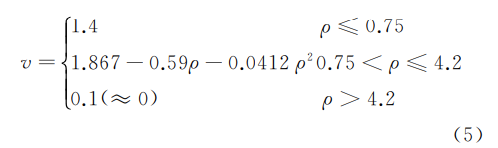

# 基于博弈论的逃生模型

问题考虑每个独立个体的行为，假设它们都希望自己能够从最短的路径逃出。

变量：

```
person_i, location_i: 每个人及所处的位置
route_ij: 人i的所有撤离路径
edge_i, number_of_person: 每条边及边上承载的人数
velocity_i = f(人员密度) = f(S / number_of_person)
edge_time_i: 通过某条边的时间长
time_i: sum edge_time_i for edge in route_ij
update_poilcy(): select route_ij with minimum time_i
```


$$
\begin{align}
\rho = \frac{num}{width*len}
\end{align}
$$

$$
cost= \frac{len}{v}
$$

- 对于给定的一条边，width, len都是已知的，因此如果再给定通过该边的人数，就得到了通过该边的cost

