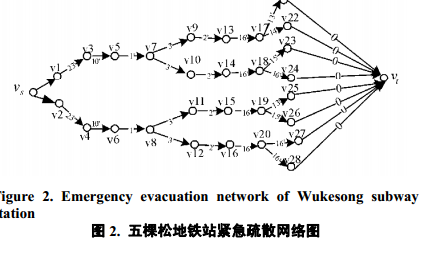
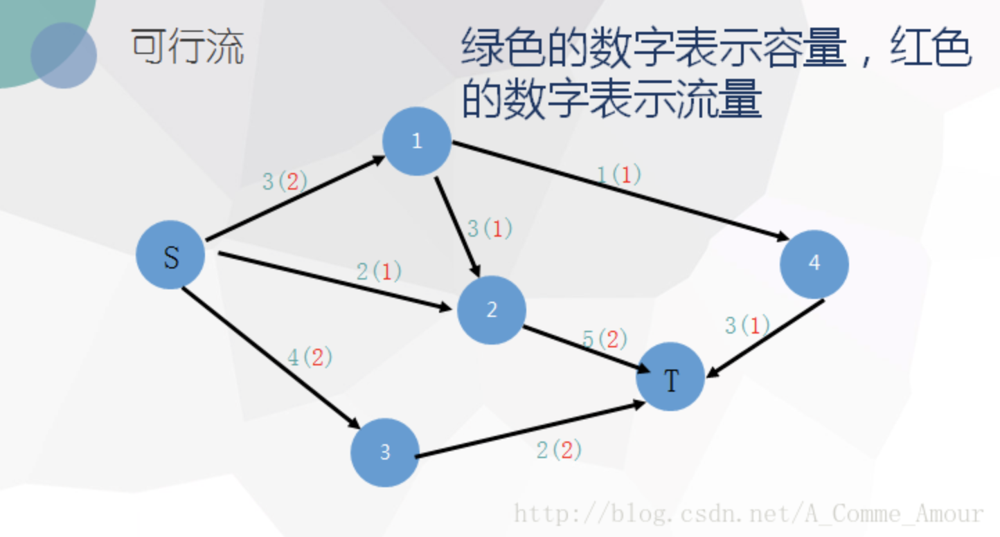

# 基于网络流的疏散模型

1. 构造疏散网络$G(V,A)$

   V包括超级源点、源点、交变点、汇点、超级汇点 Source 

   A表示连接顶点间的通道

   

1. 通道流量特征

   1. 单位面积内的流量公式

      $f = {v} \rho$ 

      其中$v$是人行走的速度，单位$m/s$ 

      $\rho$ 是单位面积的人数，单位$1/m^2$

   2. 速度与密度之间的关系

      $v = -0.0006 \rho ^ 4 + 0.0093 \rho ^ 3 + 0.0007 \rho ^ 2 - 0.4246 \rho + 1.7744 $ 

   3. 通道最大流量

      首先求出$\max f$对应的$v_m, \rho_m$ 

      通道的最大流量$c_{ij} = v_m * \rho_m * w_{ij} * \alpha$ 

      其中$w_{ij}$是顶点$i,j$之间通道的宽度，单位为$m$ 

      $\alpha$是拥挤度参数，用于控制通道的拥挤程度  

2. 人员通过通道耗时

   设$l_{ij}$是顶点$i,j$之间的长度，则乘客通过通道的时间为 

   $$
   t_{ij} = (1+\lambda)\frac{l_{ij}}{v}
   $$

   其中$\lambda$是人员通过不同类型通道（上下楼梯）时的修正参数。  

3. 问题定义

   本问题求解的是给定疏散网络以及网络中各个通道的容量$C$，通过各个通道的耗时$T$后。在博物馆中存在$Q$人时，求出一个使得总疏散时间$T_{e}$  最小的可行流$f$ 

   

   

