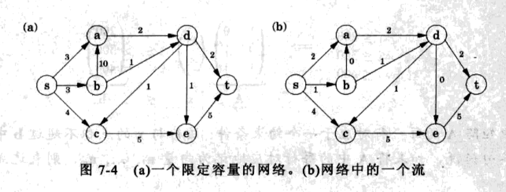
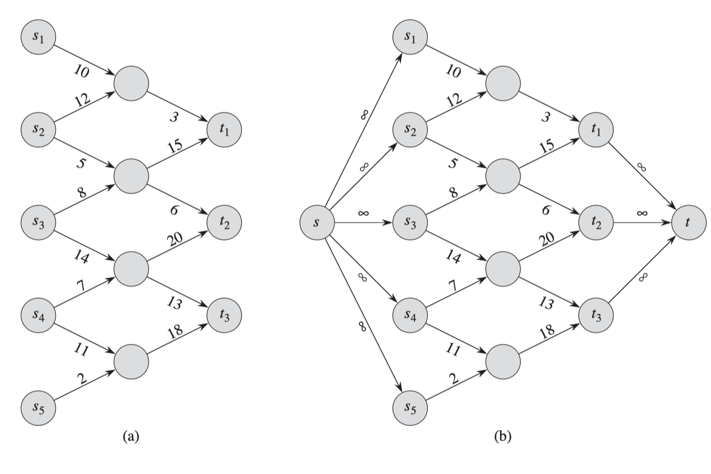

# 网络流问题的求解

## 最大流

问题定义：

给定有向图$G= (V, E)$ ，$G$有两个特殊节点$s, t \in V$，分别称为源点和汇点。$G$每条边的容量$c_e > 0$ 

在不超过每条边的容量下，希望从$s$向$t$输送尽可能多的东西。

所谓流是指一种特定的运输方式：为每条边赋予一个变量$f_e$， 使其满足

1. 不超过边的容量：
   $$
   \forall e\in E, 0 \leq f_e \leq c_e
   $$

2. 对于除了源点和汇点之外的任意节点，流出的流量等于流入的流量
   $$
   \sum_{(w,u)\in E} f_{wu} = \sum_{(u,z)\in E} f_{uz}
   $$

目的是给$f_e: e \in E$赋予一个恰当的值，使得其满足线性约束。

图中网络共有11个$e$，也就有11个$f_e$，有

1. 11个非负约束条件，$f_{e} \ge 0$
2. 11个容量条件，$f_e \le c_e$
3. 5个流量守恒条件

## 多源点多汇点

## 最小费用最大流

指定要传送的流量$Q$
$$
\sum_{w\in V} f(s,w) = d\\
\sum_{w\in V} f(w,t)  = d
$$
最小化费用
$$
\sum_{(u,v)\in E} cost_e
$$
