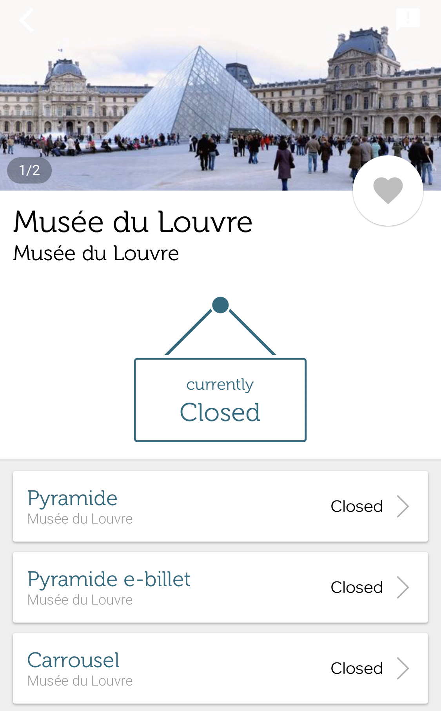

## 6 Technical Facilitation

### 6.1 App, such as "Affluences"

As the figure below, "Affluences" provides information at every main entrance, especially how many people are waiting at the entrance for admission.  This can be used to analyse which entrance is more suitable for evacuation, instead of stimulating larger scale of fear in the crowd. Using the entrance with less people waiting for admission can enhance the moving speed of the crowd when rushing out of the entrance into safe area.

Meanwhile, it is feasible to insert a warning system in the application. This system can trigger the alarm on every smartphone when it receives the evacuation signal. More remarkably, this alarm should be broadcast in different languages, depending on the system language every vistors choose to apply to their phones. In this way, the "Afflunces" is able to call for instant attention on the evacuation instruction when terror attacks happen.

### 6.2 Autonomous Navigation System using Mobile Phones

(Indoor Emergency Evacuation Service on Autonomous Navigation System using Mobile Phones) 

There are two difficult problems pertain to selection of an evacuation route according to each individual's situation, especially their location and environment. Using technology to define two essential information. First is the constant supervision of the situation of a living space and the detection of dangerous situations. Second is detection of residents' respective positions.

There are existing technology using cell phone or PDA for indoor navigation. The wireless beacon signals (引用) are especially used for this function. The user's device receives wireless beacon signals from the surrounding environment and can thereby detect a user's position by a mobile terminal independently. This system is capable of performing robust positioning in noisy environments. Meanwhile, it provides autonomous positioning in cell phone as long as reliable performance in crowded environments. All these advanced functions assure the emergency evacuation can be operated efficiently and correctly, In this way, visitors can be evacuated out of the Louvre fast and safely.

Specifically speaking, this technology provides the Louvre management with several inspirations. First of all, utilizing sensor-data management system to manage the information needed for evacuation in real-time mode. Secondly, installing various sensors in the Louvre to detect emergencies and integrate the situation in time. Last but not least, the wireless beacon devices in the environment can navigate people correctly when evacuating. Meanwhile, it involves no stationary terminal, but portable terminals.

It is obvious that using this kind of indoor emergency evacuation service can effectively improve the feasibility of the evacuation plan.